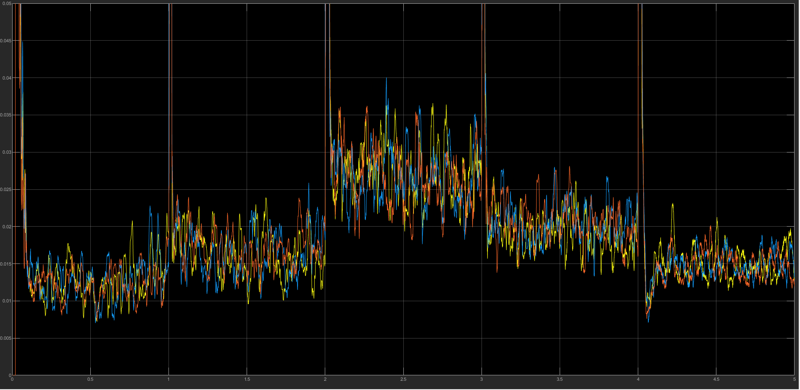

# Total Harmonic Distortion (THD) Analysis

This document describes the harmonic analysis performed on the grid current in the simulation.

---

## Objective

The purpose of THD analysis is to evaluate the quality of current injected into the grid.

Low harmonic distortion is important for:

- Grid stability
- Power quality
- Compliance with grid standards

---

## Method Used

THD was calculated using THD analysis block of the grid current waveform in MATLAB/Simulink.

Steps:

1. Measure grid current
2. Perform THD analysis
3. Calculate harmonic components
4. Compute THD percentage

---

## Standard Limits

According to IEEE standards:

Grid current THD should typically be below:

5%

This ensures acceptable power quality.

---

## Simulation Results

The measured THD values for different irradiance levels are:

| Irradiance | THD Range |
|-----------|----------|
1000 W/m² | 0.8 – 2.2%  
800 W/m² | 1 – 2.5%  
500 W/m² | 1.85 – 3.96%  
700 W/m² | 1.39 – 2.76%  
1500 W/m² | 0.7 – 2.3%  

---

## Observations

- THD increases slightly at lower irradiance.
- Lower PV current results in higher relative harmonic content.
- Overall THD remained below IEEE limits.

---

## Conclusion

The inverter and filter design successfully maintain low harmonic distortion under varying operating conditions.

This indicates:

- Effective current control
- Proper LCL filter operation
- Good grid integration performance